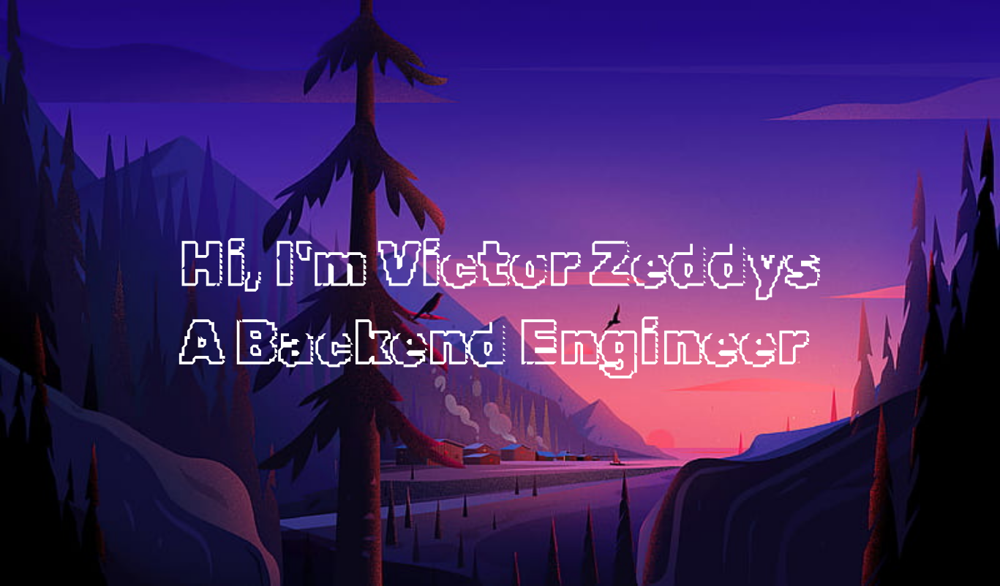

I'm a Kenyan backend engineer focusing more on building distributed systems. I also double as a Web3 engineer.

__About Me__
1. I have experience working with Self Sovereign Identity services on Cardano while acting as the Tech Lead.
2. I am an expert in Rust❤️ and Spring Boot(Java/Kotlin).
3. I have intermediate knowledge in Go and have used it before in a professional setting.

<!--
**Zeddling/Zeddling** is a ✨ _special_ ✨ repository because its `README.md` (this file) appears on your GitHub profile.

Here are some ideas to get you started:

- 🔭 I’m currently working on ...
- 🌱 I’m currently learning ...
- 👯 I’m looking to collaborate on ...
- 🤔 I’m looking for help with ...
- 💬 Ask me about ...
- 📫 How to reach me: ...
- 😄 Pronouns: ...
- ⚡ Fun fact: ...
-->
