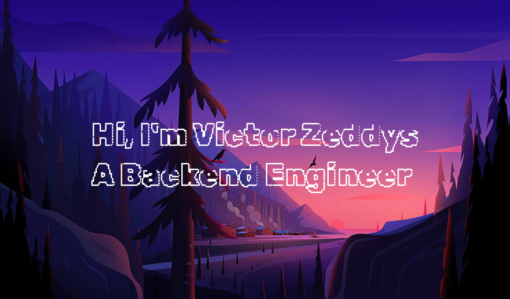

I'm a Kenyan software engineer and tech consultant focusing more on building distributed systems.

__About Me__
1. Java and Go are my daily bread. Sometimes, I feel rusty 🦀;
2. When the code doesn't work, I bang a chord on the piano

Got a project/hackathon you want to try out?

email: victorzeddys@protonmail.com
gitlab: https://gitlab.com/Zeddling

<!--
**Zeddling/Zeddling** is a ✨ _special_ ✨ repository because its `README.md` (this file) appears on your GitHub profile.

Here are some ideas to get you started:

- 🔭 I’m currently working on ...
- 🌱 I’m currently learning ...
- 👯 I’m looking to collaborate on ...
- 🤔 I’m looking for help with ...
- 💬 Ask me about ...
- 📫 How to reach me: ...
- 😄 Pronouns: ...
- ⚡ Fun fact: ...
-->
